# Image Generation from Scratch

Welcome to the "Image Generation from Scratch" repository! This project is dedicated to building image generation models from scratch using PyTorch. In this repository, you'll find both GANs (Generative Adversarial Networks) and Diffusion models implemented from the ground up.

## Table of Contents

- [Introduction](#introduction)
- [Getting Started](#getting-started)
- [Implementation Details](#implementation-details)
- [Usage](#usage)
- [Results](#results)
- [Contributing](#contributing)
- [License](#license)

## Introduction

This repository explores the world of generative modeling, showcasing both GANs and Diffusion models. These models have gained significant attention in the field of deep learning due to their effectiveness in image generation, denoising, and other related tasks.

## Getting Started

Before diving into the code and experiments, make sure you have the following prerequisites installed:

- Python (3.6+)
- PyTorch (1.6+)
- NumPy
- Matplotlib (for visualization, optional)
- Jupyter Notebook (for running examples, optional)

To clone this repository, use the following command:

```bash
git clone https://github.com/SRDdev/image-generation.git
```

Navigate to the project directory:

```bash
cd IMAGE-GENERATION
```

```bash
pip install requirements.txt
```

```bash
python test.py
```

## Implementation Details

This section provides an overview of the key components and techniques used in your implementation of both GANs and Diffusion models:

- **GANs**: Explain the concept of Generative Adversarial Networks and how they are implemented in your code.

- **Diffusion Process**: Describe the concept of diffusion in generative modeling and how it is implemented in your code.

- **Loss Functions**: Discuss the loss functions used for training both GANs and Diffusion models, such as adversarial loss and negative log-likelihood loss.

- **Architecture**: Provide details on the neural network architectures used in your implementation, including the number of layers, activation functions, and any other relevant architectural choices.

- **Training Procedure**: Outline the training procedure for both types of models, including optimizer choices, learning rate schedules, and any data augmentation or preprocessing steps.

## Usage

To use the image generation models implemented in this repository, follow these steps:

1. **Training**: Train your GANs or Diffusion models on your dataset of choice. Provide clear instructions and example commands for training.

2. **Generation**: Demonstrate how to generate samples from the trained models. Include code examples and explanations of the parameters to adjust.

3. **Evaluation**: Discuss how to evaluate the quality of generated samples, such as using quantitative metrics or visual inspection.

## Results

In this section, showcase the results and performance of your image generation models. Include generated samples, comparison between GANs and Diffusion models, if applicable, and any quantitative evaluation results. Visualizations and plots can be especially helpful for conveying your findings.

## Generated 
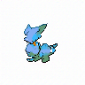 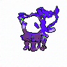  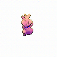 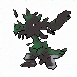 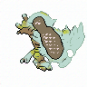 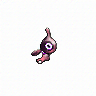 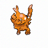  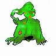 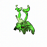 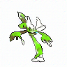 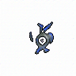  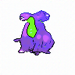 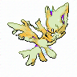 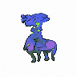  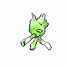


## Contributing

Contributions to this repository are welcome! If you'd like to contribute, please follow these guidelines:

- Fork the repository.
- Create a new branch for your contributions.
- Make your changes and commit them with descriptive commit messages.
- Push your changes to your fork.
- Submit a pull request to the main repository.

## License

This project is licensed under the MIT License - see the [LICENSE](LICENSE) file for details.

---

Thank you for exploring the "Image Generation from Scratch" repository. Whether you're interested in GANs, Diffusion models, or generative modeling in general, this repository is a valuable resource for understanding and experimenting with these techniques. If you have any questions, issues, or suggestions, please don't hesitate to reach out and share your thoughts. 🖼️🤖
